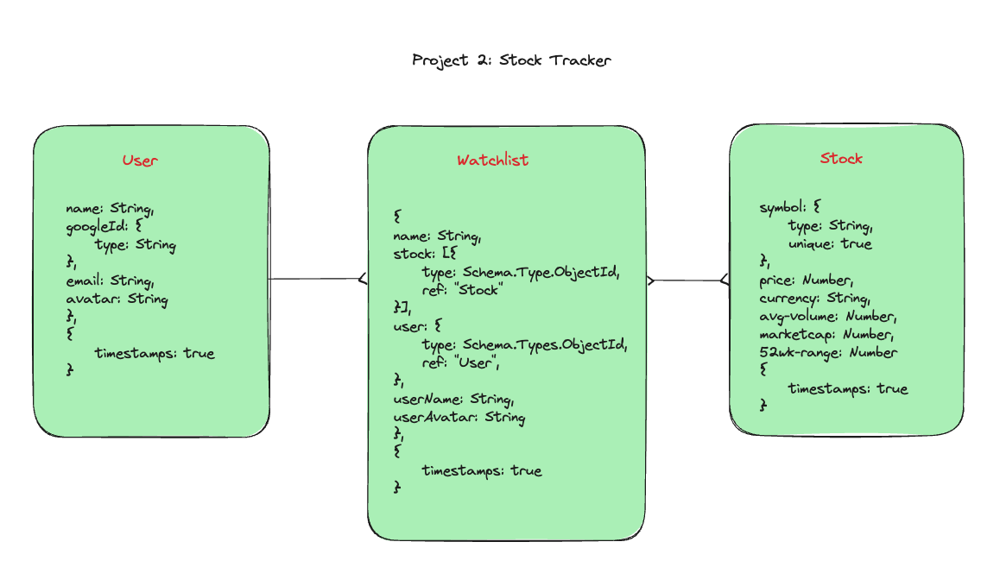

# Stock Tracker 

## Table of Contents

- [Introduction](#Introduction)
- [Technologies Used](#Technologies-Used)
- [Features](#Features)
- [Installation](#Installation)
- [Future Icebox](#Future-Icebox)
- [Contributing](#Contribution)

## Introduction

Welcome to the Stock Tracker repository! This hobby project ideation originated with my own difficulties in finding a site that allows you to create a portfolio watchlist tracking your favourite stocks. There are a lot of choices out there but most have to have a paid plan or have way too much content that you may or may not be interested in. The app is implemented using NodeJs Express and MangoDB on the backend and HTML, CSS, and JavaScript on the frontend. 

## Wireframe & ERD (Entity Relationship Diagram)


### [DEMO LIVE LINK](https://stock-tracker-29af93574a43.herokuapp.com "target=_blank")

## Technologies Used


<!--


 -->

## Features

- Intuitive User Interface: Sleek and modern home page with a visually appealing dark or light mode theme, allowing you to customize the look and feel to your preference
- Real-Time Market Data(15min delay): Seamless integration with the Alpha Vantage API ensures you receive near real-time market data on your selected tickers, keeping you informed of the latest price movements.
- Responsive Design: built with a mobile-first approach, ensuring a smooth and consistent experience across a wide range of devices and screen sizes, from desktops to smartphones.
- Personalized Watchlists: Create and manage your own watchlists with full CRUD (Create, Read, Update, Delete) functionality, allowing you to easily track the stocks that matter most to you.

## Installation

To run the Stock Tracker App locally, follow these steps:

1. Clone the repository:

```html
git clone https://github.com/akyeshi/stock-tracker.git
```

2. Navigate to the project directory:

```html
cd stock-tracker
```

3. Install Node Module packages
```html
npm install 
```
4. Start the server
```html
npm start/nodemon 
```


## Future Icebox

These are the feature on its way:

1. Free API source to get unlimited realtime market data 

2. Sorting on the name and price of tickers

3. Search functionality adding a ticker to a watchlist 

4. Ability to view public watchlists 

5. Ability to click on a ticker and have a discussion page on the ticker 

6. Preserving user chosen dark/light mode theme throughout the session

## Contributing

We welcome contributions to the Blackjack Game project. If you would like to contribute, please follow these steps:

1. Fork the repository.

2. Create a new branch for your feature or bug fix.

3. Make your changes and commit them.

4. Push your changes to your forked repository.

5. Submit a pull request to the main repository.
